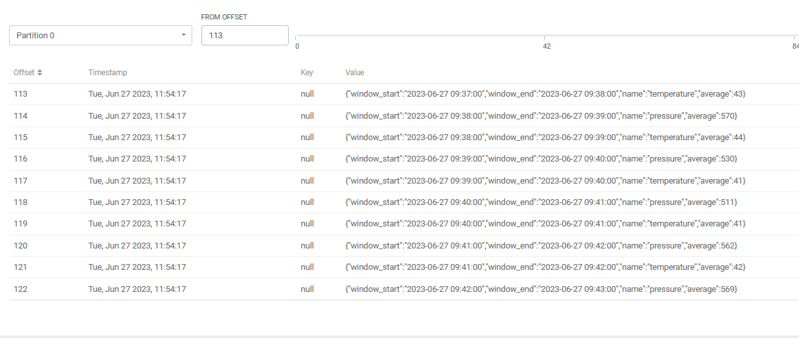
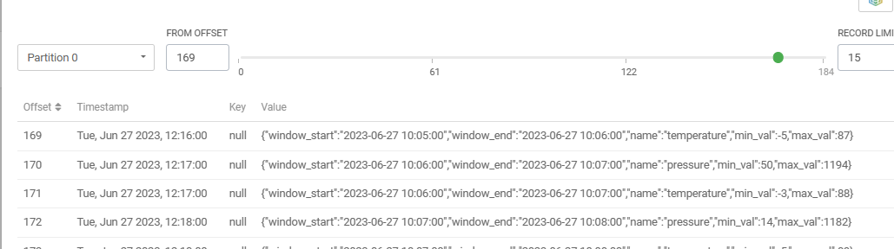
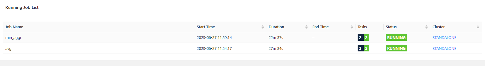

# Datenaggregation mit Kafka und Flink
In diesem Projekt aggregieren wir Sensordaten, die in einem Kafka-Topic namens `sensor_readings` eintreffen, mit Hilfe von Apache Flink. 
Es werden durchschnittliche Sensormesswerte innerhalb von Tumbling-Fenstern von einer Minute berechnet. Die Ergebnisse werden sowohl in eine Flink-Tabelle 
als auch in ein Kafka-Topic namens `sensor_readings_avg` geschrieben. Außerdem erstellen wir zusätzliche Statistiken für jedes Gerät und jeden Messungstyp, 
einschließlich des minimalen und maximalen Wertes, und speichern diese in einem weiteren Kafka-Topic namens `sensor_readings_extra`

## Schritt 1: Erstellen der Aggregationstabelle und des Topics
Zuerst haben wir eine Tabelle und ein Kafka-Topic für die aggregierten Messwerte erstellt:

```sql
CREATE TABLE `lab07_kafka_sensor_reading_avg` (
    `window_start` TIMESTAMP(3),
    `window_end` TIMESTAMP(3),
    `name` STRING,
    `average` BIGINT
) WITH (
    'connector' = 'kafka: lab07_kafka',
    'format' = 'json',
    'scan.startup.mode' = 'earliest-offset',
    'topic' = 'sensor_readings_avg'
);
```
Diese Tabelle speichert den Anfang und das Ende jedes Zeitfensters, den Gerätenamen und den Durchschnittswert für dieses Fenster.

## Schritt 2: Füllen der Aggregationstabelle
Dann haben wir eine SQL-Anweisung ausgeführt, um die Daten in der `sensor_readings` Tabelle zu aggregieren und in die `sensor_reading_avg` Tabelle einzufügen:

```sql
INSERT INTO lab07_kafka_sensor_reading_avg
SELECT 
    TUMBLE_START(time_ltz, INTERVAL '1' MINUTE) as window_start,
    TUMBLE_END(time_ltz, INTERVAL '1' MINUTE) as window_end,
    name,
    AVG(val) as average
FROM lab07_kafka_sensor_reading1
GROUP BY
    TUMBLE(time_ltz, INTERVAL '1' MINUTE),
    name;
```


Durschnittliche Werte im Kafka Topic


## Schritt 3: Erstellen der Tabelle und des Topics für zusätzliche Statistiken
Als nächstes haben wir eine weitere Tabelle und ein weiteres Kafka-Topic für zusätzliche Statistiken erstellt:

```sql
CREATE TABLE sensor_readings_extra (
    `window_start` TIMESTAMP(3),
    `window_end` TIMESTAMP(3),
    `name` STRING,
    `min_val` INT,
    `max_val` INT
) WITH (
    'connector' = 'kafka: lab07_kafka',
    'format' = 'json',
    'scan.startup.mode' = 'earliest-offset',
    'topic' = 'sensor_readings_extra'
);
```

## Schritt 4: Füllen der Tabelle mit zusätzlichen Statistiken
Schließlich haben wir eine weitere SQL-Anweisung ausgeführt, um zusätzliche Statistiken zu berechnen und in die sensor_readings_extra-Tabelle einzufügen:
```sql
INSERT INTO sensor_readings_extra
SELECT 
    TUMBLE_START(time_ltz, INTERVAL '1' MINUTE) AS window_start,
    TUMBLE_END(time_ltz, INTERVAL '1' MINUTE) AS window_end,
    name,
    MIN(val) AS min_val,
    MAX(val) AS max_val
FROM lab07_kafka_sensor_reading1
GROUP BY 
    TUMBLE(time_ltz, INTERVAL '1' MINUTE), 
    name;
```
Diese Abfrage berechnet den minimalen und maximalen Messwert für jedes Gerät und jedes Zeitfenster und fügt die Ergebnisse in die `sensor_readings_extra` Tabelle ein. Dabei werden die Ergebnisse auch an das Kafka-Topic sensor_readings_extra gesendet.
Hier ein Auschnitt des topics: 


## Übersicht der Jobs



